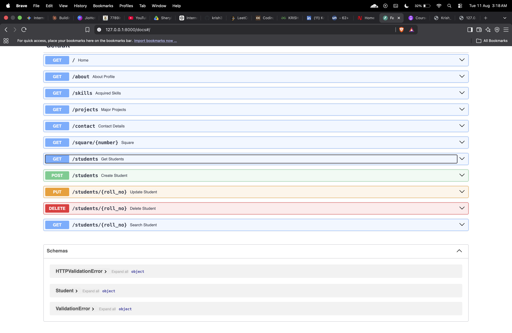

# FastAPI Student Management System

A REST API for managing student records using FastAPI and PostgreSQL.

## Features

- Create a new student
- Retrieve all students
- Retrieve a student by roll number
- Update student information
- Delete a student
- PostgreSQL database integration
- Error handling for invalid requests and database errors
- Automatic API documentation with Swagger UI

## Tech Stack

- Python
- FastAPI
- Pydantic
- PostgreSQL
- Psycopg
- Uvicorn

## API Endpoints

| Method | Endpoint | Description |
|--------|----------|-------------|
| POST | `/students` | Create a new student |
| GET | `/students` | Get all students |
| GET | `/students/{roll_no}` | Get a student by roll number |
| PUT | `/students/{roll_no}` | Update a student |
| DELETE | `/students/{roll_no}` | Delete a student |

## API Documentation

The API includes automatically generated interactive documentation using FastAPI's Swagger UI.



## Student Data

Each student record contains:

- `roll_no` - Student roll number
- `name` - Student name
- `age` - Student age
- `branch` - Student branch

## Database

The project uses PostgreSQL to store student records.

Create a PostgreSQL database and configure the connection in the application before running the API.


## How to Run

### 1. Clone the repository

```bash
git clone https://github.com/krish373/FastAPI-Student-Management.git
cd FastAPI-Student-Management

python -m venv .venv
MacOS/Linux-
source .venv/bin/activate
Windows-
.venv\Scripts\activate

pip install -r requirements.txt

Create a .env file:

DB_HOST=localhost
DB_NAME=student_api
DB_USER=your_username
DB_PORT=5432
DB_PASSWORD=your_password

uvicorn main:app --reload

The API will be available at:

http://127.0.0.1:8000

Interactive API documentation:

http://127.0.0.1:8000/docs